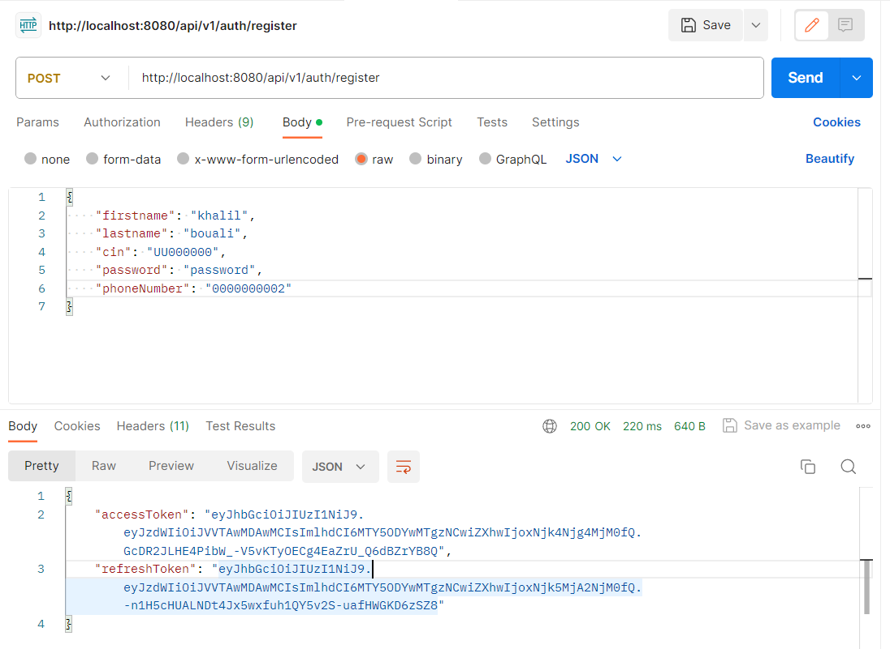
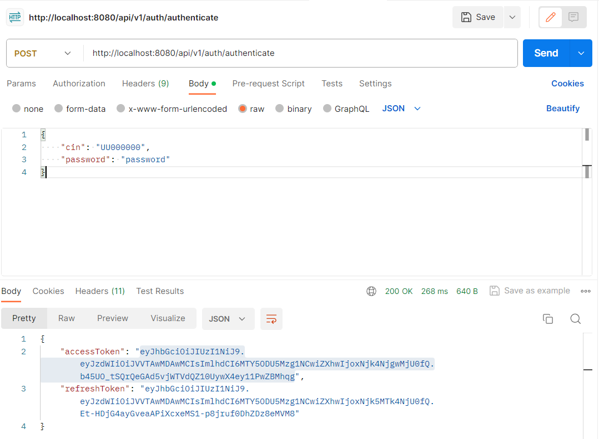
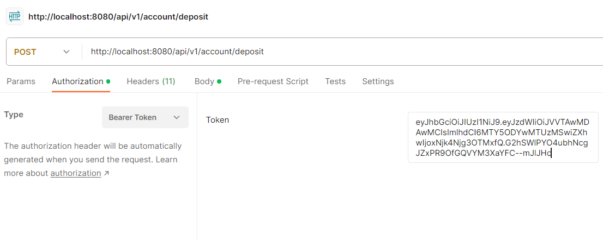
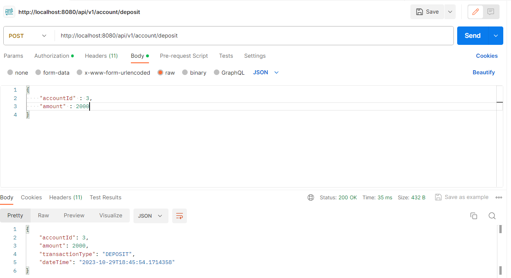
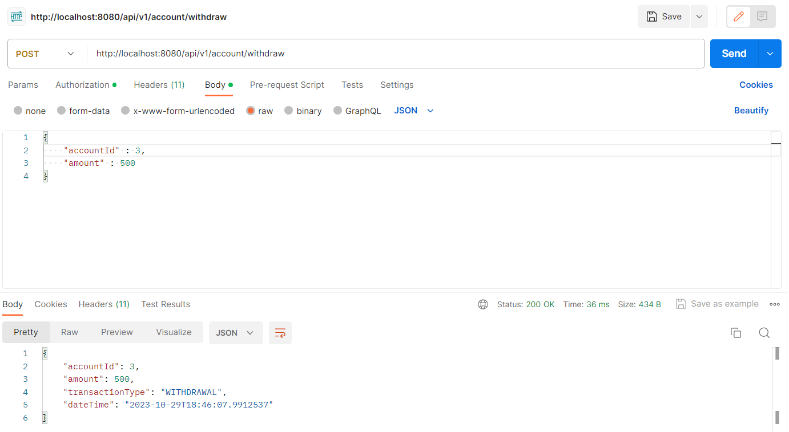
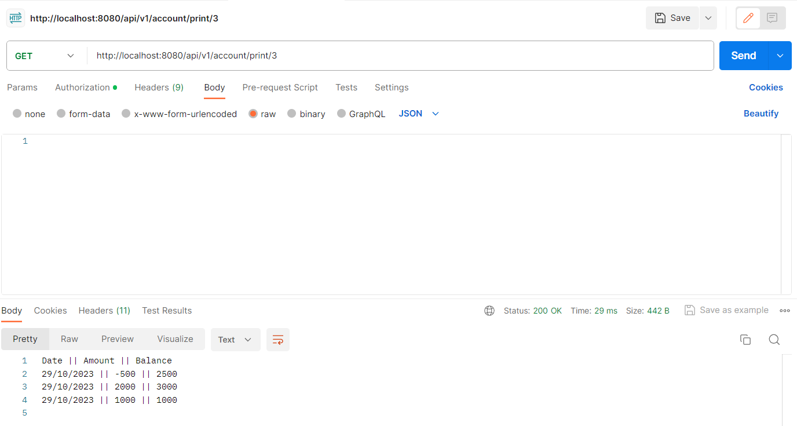

# Skypay Technical Test: Bank Kata

This is a technical test demo project for the company Skypay, implementing a banking account transaction system (deposit, withdrawal) and a bank statement print, using spring boot 3, spring data jpa and spring security with jwt.

### Steps to follow:

1. Install PostgreSQL and create a database named "bank_kata".
2. Update the url, username and password in the application.yml file to have a valid datasource connection.
3. Don't forget to reload maven dependencies.
4. Launch the application, an Admin and a Manager account will be inserted in the database.
5. Use postman or a similar tool to register a new account, authenticate, then deposit, withdraw and print.

##### Step 5 detailed screenshots:
1. Register:

You can use the access token (not the refresh token) provided as a response or get an access token from the authentication process.

2. Authenticate:

Copy the access token (not the refresh token) provided as a response and use it as a Bearer token authorization. Without it, you have no access to the endpoints.

3. Deposit:

- Paste the access token as shown below:

- Make sure to use the correct account id (double check from the database)

4. Withdraw:

- Use the access token as a Bearer token authorization as shown previously and make sure to use the correct account id.

- Repeat deposits and withdrawals as much as wanted.

5. Print:
- Use the access token as a Bearer token authorization as shown previously and make sure to pass the correct account id as a path parameter.

The responses can be changed to avoid sensitive data leakage. This is only for
testing purposes.

**PS:** I identified an architecture issue that forced me not to respect the given rules.
I had to change the signature of the methods in the AccountService interface.
The issue is as follows:
- Without the account id, the deposits, withdrawals and prints can not be done.
- The solution would be to declare a private field in the Account service bean
to identify the account but this would require a public setter to instantiate the field
after the user authenticates and would also require many instances of that bean each one
with its own value.
- The issue here is that the account id or CIN or any other attribute
is an entity attribute and should not be declared in the service bean.

The respected architecture is as follows:
